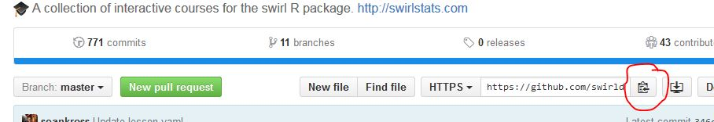

# About Git And GitHub

## Basic instructions for the newbie Git user

**disclaimer**: I'm offering this page as some guidance to those just starting off with Git and GitHub. I'm not an expert (just a student like yourself). 

### some basic training and books that I've used in the past

[www.pluralshight.com](www.pluralsight.com) has some on-line training for Git and GitHub (and they offer a free 10 day trail so you can so all of these if you wish)

* Introduction to Git
* Git Fundamentals
* GitHub for Windows Developers

A book that I've found useful: *Version Control with Git*  by Jon Loeliger (first 88 pages)

And there is also the GitHub self-paced training: [Start Learning Git and GitHub Today with Self-Paced Training](https://github.com/blog/2083-start-learning-git-and-github-today-with-self-paced-training)

### My environment
I'm using Windows 7 and currently use R version 3.2.3.

I've also install GitHub Desktop (https://desktop.github.com/) but make use of the bash shell (see more about this below)

### Basic Steps (for getting some files up to GitHub)

Here is what I did to get started using Git and GitHub.

I'm using GitHub Desktop but I'm mostly using the Git Shell that comes with it versus
the GitHub GUI. Note that Git shell (at least for me) was installed with Windows Powershell instead of Bash for the
shell app. I needed to open the GitHub GUI and go to settings to get it to default to the bash shell.
The GUI has a little 'cog' icon in the upper right of the window. Click on it and select Options to set the Default
shell to Git Bash.

Get yourself a GitHub account (I assume this is not an issue for you)

I find it easier to always create a repository on GitHub and clone it to my local machine (versus starting at the local and going the other way):

1. create the repo on GitHub (or create a fork...depends on the course and project you are working on)
2. copy the repo https address (for use in your git bash on your local machine). Here is an image of what I'm talking about off a repo on GitHub:



3. open up your git bash shell and navigate to wherever you wish to put your new repo folder
4. type the following:
```
git clone <paste your https address from step b here>
```
so an explicit example of this would be when I setup my local clone of the repository you are currently looking at:
```
 git clone git@github.com:pmPartch/AboutGitAndGitHub.git
```

5. You can now change to this directory by typing cd <new repo name> like so:
```
 cd AboutGitAndGitHub/
```
6. Now you can just copy, paste files to his new folder on your local machine.
6. you will need to add these new files to your local git repo like so:
```
git add .
```
7. and you will need to commit these changes to your local repo like so (use some sort of reason why you are committing this change):
```
git commit -m "Initial Revision"
```
8. now you should be ready to push your changes up to your GitHub repo like so:
```
git push
```
NOTE: I've found using the status command very useful in keeping track of what is going on (and what I might have missed). So you might want to periodically type this:
```
git status
```

Some basic notes about Git. It does not really care much about file names. It is looking at file contents.
So if you have already added a file foo.txt and you have changed foo.txt, you will need to 
add it again (since you are asking git to update your repo with new file contents)

An extreme example of this: say I have file A.txt, B.txt , C.txt and all three files have the same identical content. I then add all three to my Git repo like so (using wild card for the file name):
```
git add ?.txt
```
Now I commit all three files like so:
```
git commit m="Initial Revision"
```
What has now happened (at least in my mind) is that Git has saved a single copy of the file contexts and setup a dictionary to map the three file names to the single contents.
But what happens if you modify a single file, say B.txt? Well, git performs a copy-on-change so when you do modify a single file it will now need to make a copy where A.txt and C.txt refer to the original contents and B.txt refers to the new contents.


